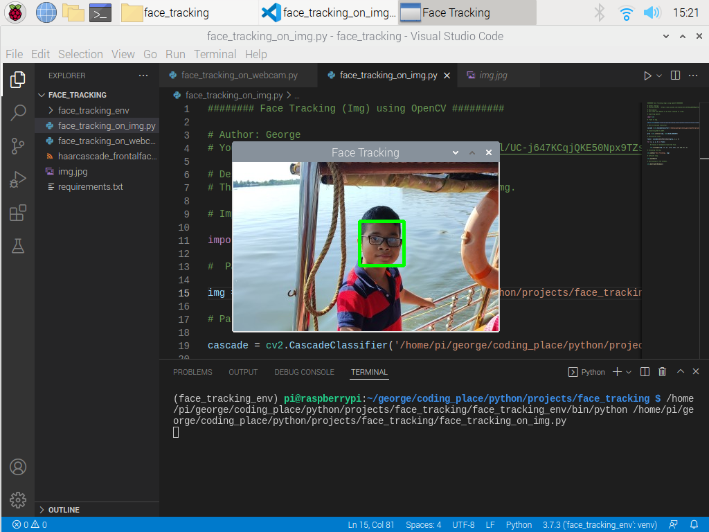

<div align="center"><h1>Face Tracking</h1></div>

<div align="center"><p>A guide showing how to do Face Tracking using OpenCV on a Raspberry pi.</p></div>

<div align="center"></div>

<h2>Versions that I am using.</h2>

<p>In my case I am using Python 3.7.3, If you want to download Python 3.7.3 on Windows, Mac and Linux go to https://www.python.org/downloads/ and download it and for the OpenCV I am using OpenCV 4.5.5.62 because I am using Python 3.7.3 if you are using some other version of python you might need to play around with the OpenCV version.</p>

<h2>1. Simple method of installing python on Raspberry pi</h2>

```
sudo apt-get install python3.7
```

<h2>2. Install OpenCV</h2>

```
pip3.7 install opencv-contrib-python==4.5.5.62
```

<h2>3. Clone the repository</h1>

```
git clone https://github.com/geekydoodle/face_tracking.git
```

<h2>4. Change directory into the folder.</h2>

```
cd face_tracking
```

<h2>5. Make a venv</h2>

<p>Install venv package</p>
  
```
sudo apt-get install python3.7-venv
```

<p>Make a venv</p>

```
python3.7 -m venv name_of_venv
```
